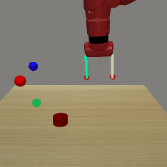

# Metaworld Environment Wrappers

This module includes wrappers that are required to work 
with `metaworld` [link](https://github.com/rlworkgroup/metaworld).
In particular, we implemented a camera wrapper that directly
taps into the underlying `env.sim.render` function as opposed
to the gym environment `env.render` which is not implemented
in metaworld [L:111-113](https://github.com/rlworkgroup/metaworld/blob/master/metaworld/envs/mujoco/mujoco_env.py#L109-L111).

This wrapper makes it easy.

# Usage Example

We register single task metaworld environments under the 
`env_wrappers.metaworld` module, so that you can use `gym
.make` to create the environments without have to import
`metaworld` manually.


```python
import gym
from env_wrappers.metaworld import ALL_ENVS

for env_id in ALL_ENVS:
    env = gym.make(f'env_wrappers.metaworld:{env_id}')
    frames = []
    for i in range(10):
        env.reset()
        frames.append(env.render("rgb", width=240, height=240))
    doc.video(frames, f"videos/{env_id}.gif")
    break
```



The full list of environments are

```yaml
- Reach-v1
- Push-v1
- Pick-place-v1
- Door-open-v1
- Drawer-open-v1
- Drawer-close-v1
- Button-press-topdown-v1
- Peg-insert-side-v1
- Window-open-v1
- Window-close-v1
- Door-close-v1
- Reach-wall-v1
- Pick-place-wall-v1
- Push-wall-v1
- Button-press-v1
- Button-press-topdown-wall-v1
- Button-press-wall-v1
- Peg-unplug-side-v1
- Disassemble-v1
- Hammer-v1
- Plate-slide-v1
- Plate-slide-side-v1
- Plate-slide-back-v1
- Plate-slide-back-side-v1
- Handle-press-v1
- Handle-pull-v1
- Handle-press-side-v1
- Handle-pull-side-v1
- Stick-push-v1
- Stick-pull-v1
- Basketball-v1
- Soccer-v1
- Faucet-open-v1
- Faucet-close-v1
- Coffee-push-v1
- Coffee-pull-v1
- Coffee-button-v1
- Sweep-v1
- Sweep-into-v1
- Pick-out-of-hole-v1
- Assembly-v1
- Shelf-place-v1
- Push-back-v1
- Lever-pull-v1
- Dial-turn-v1
- Bin-picking-v1
- Box-close-v1
- Hand-insert-v1
- Door-lock-v1
- Door-unlock-v1
```
