# Metaworld Environment Wrappers

> This document, including the embedded video, is generated 
> by [[cmx]](./__init__.py)

This module includes wrappers that are required to work 
with `Meta-World` [link](https://github.com/rlworkgroup/metaworld).
In particular, we implemented a camera wrapper that directly
taps into the underlying `env.sim.render` function as opposed
to the gym environment `env.render` which is not implemented
in metaworld [L:111-113](https://github.com/rlworkgroup/metaworld/blob/master/metaworld/envs/mujoco/mujoco_env.py#L109-L111).

This wrapper makes it easy.

# Usage Example

We register single task Meta-World environments under the 
`env_wrappers.metaworld` module, so that you can use `gym
.make` to create the environments without have to import
`metaworld` manually.

```python
import gym
from env_wrappers.metaworld import ALL_ENVS

for i, env_id in enumerate(ALL_ENVS[:]):
    if i % 5 == 0:
        row = t.figure_row()
    env = gym.make(f'env_wrappers.metaworld:{env_id}')
    frames = []
    for i in range(10):
        env.reset()
        env.step(env.action_space.sample())
        frames.append(env.render("rgb", width=240, height=240))
    row.video(frames, f"videos/{env_id}.gif", caption=env_id)
```

| 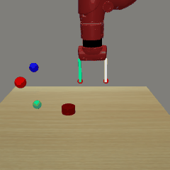 |  |  |  |  |
|:-------------------------------------------:|:-------------------------------------------------------:|:-----------------------------------------:|:-----------------------------------------------------:|:-----------------------------------------------------:|
| Reach-v1 | Reach-fixed-v1 | Push-v1 | Push-fixed-v1 | Pick-place-v1 |
|  |  |  |  |  |
| Pick-place-fixed-v1 | Door-open-v1 | Door-open-fixed-v1 | Drawer-open-v1 | Drawer-open-fixed-v1 |
| 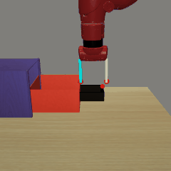 |  |  |  |  |
| Drawer-close-v1 | Drawer-close-fixed-v1 | Button-press-topdown-v1 | Button-press-topdown-fixed-v1 | Peg-insert-side-v1 |
|  | 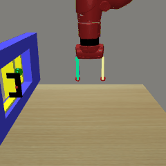 |  |  |  |
| Peg-insert-side-fixed-v1 | Window-open-v1 | Window-open-fixed-v1 | Window-close-v1 | Window-close-fixed-v1 |
|  |  |  |  |  |
| Door-close-v1 | Door-close-fixed-v1 | Reach-wall-v1 | Reach-wall-fixed-v1 | Pick-place-wall-v1 |
|  |  |  |  |  |
| Pick-place-wall-fixed-v1 | Push-wall-v1 | Push-wall-fixed-v1 | Button-press-v1 | Button-press-fixed-v1 |
|  |  | 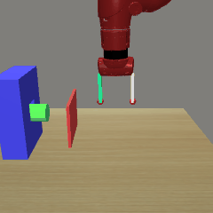 |  |  |
| Button-press-topdown-wall-v1 | Button-press-topdown-wall-fixed-v1 | Button-press-wall-v1 | Button-press-wall-fixed-v1 | Peg-unplug-side-v1 |
|  |  |  |  |  |
| Peg-unplug-side-fixed-v1 | Disassemble-v1 | Disassemble-fixed-v1 | Hammer-v1 | Hammer-fixed-v1 |
|  |  |  |  |  |
| Plate-slide-v1 | Plate-slide-fixed-v1 | Plate-slide-side-v1 | Plate-slide-side-fixed-v1 | Plate-slide-back-v1 |
|  |  |  |  |  |
| Plate-slide-back-fixed-v1 | Plate-slide-back-side-v1 | Plate-slide-back-side-fixed-v1 | Handle-press-v1 | Handle-press-fixed-v1 |
| 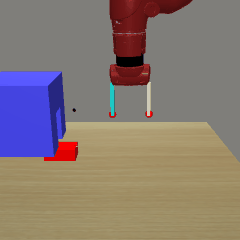 |  |  |  |  |
| Handle-pull-v1 | Handle-pull-fixed-v1 | Handle-press-side-v1 | Handle-press-side-fixed-v1 | Handle-pull-side-v1 |
|  | 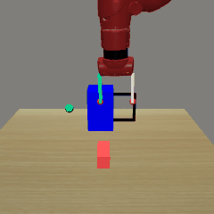 |  |  |  |
| Handle-pull-side-fixed-v1 | Stick-push-v1 | Stick-push-fixed-v1 | Stick-pull-v1 | Stick-pull-fixed-v1 |
|  |  | 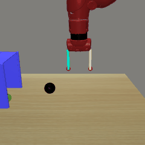 |  | 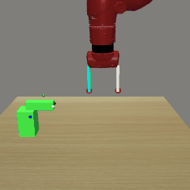 |
| Basketball-v1 | Basketball-fixed-v1 | Soccer-v1 | Soccer-fixed-v1 | Faucet-open-v1 |
|  | 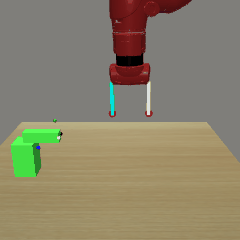 | 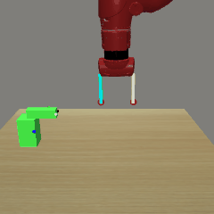 |  |  |
| Faucet-open-fixed-v1 | Faucet-close-v1 | Faucet-close-fixed-v1 | Coffee-push-v1 | Coffee-push-fixed-v1 |
|  |  |  |  |  |
| Coffee-pull-v1 | Coffee-pull-fixed-v1 | Coffee-button-v1 | Coffee-button-fixed-v1 | Sweep-v1 |
|  | 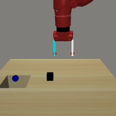 |  |  |  |
| Sweep-fixed-v1 | Sweep-into-v1 | Sweep-into-fixed-v1 | Pick-out-of-hole-v1 | Pick-out-of-hole-fixed-v1 |
| 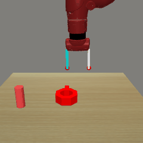 |  | 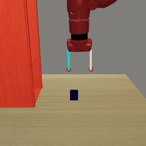 |  | 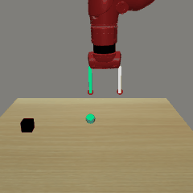 |
| Assembly-v1 | Assembly-fixed-v1 | Shelf-place-v1 | Shelf-place-fixed-v1 | Push-back-v1 |
|  |  |  | 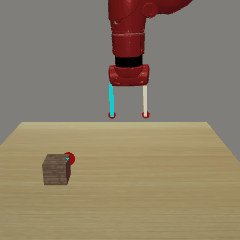 | 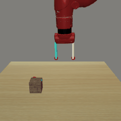 |
| Push-back-fixed-v1 | Lever-pull-v1 | Lever-pull-fixed-v1 | Dial-turn-v1 | Dial-turn-fixed-v1 |
|  |  |  |  |  |
| Bin-picking-v1 | Bin-picking-fixed-v1 | Box-close-v1 | Box-close-fixed-v1 | Hand-insert-v1 |
|  |  |  |  |  |
| Hand-insert-fixed-v1 | Door-lock-v1 | Door-lock-fixed-v1 | Door-unlock-v1 | Door-unlock-fixed-v1 |

The full list of environments are

```yaml
- Reach-v1
- Reach-fixed-v1
- Push-v1
- Push-fixed-v1
- Pick-place-v1
- Pick-place-fixed-v1
- Door-open-v1
- Door-open-fixed-v1
- Drawer-open-v1
- Drawer-open-fixed-v1
- Drawer-close-v1
- Drawer-close-fixed-v1
- Button-press-topdown-v1
- Button-press-topdown-fixed-v1
- Peg-insert-side-v1
- Peg-insert-side-fixed-v1
- Window-open-v1
- Window-open-fixed-v1
- Window-close-v1
- Window-close-fixed-v1
- Door-close-v1
- Door-close-fixed-v1
- Reach-wall-v1
- Reach-wall-fixed-v1
- Pick-place-wall-v1
- Pick-place-wall-fixed-v1
- Push-wall-v1
- Push-wall-fixed-v1
- Button-press-v1
- Button-press-fixed-v1
- Button-press-topdown-wall-v1
- Button-press-topdown-wall-fixed-v1
- Button-press-wall-v1
- Button-press-wall-fixed-v1
- Peg-unplug-side-v1
- Peg-unplug-side-fixed-v1
- Disassemble-v1
- Disassemble-fixed-v1
- Hammer-v1
- Hammer-fixed-v1
- Plate-slide-v1
- Plate-slide-fixed-v1
- Plate-slide-side-v1
- Plate-slide-side-fixed-v1
- Plate-slide-back-v1
- Plate-slide-back-fixed-v1
- Plate-slide-back-side-v1
- Plate-slide-back-side-fixed-v1
- Handle-press-v1
- Handle-press-fixed-v1
- Handle-pull-v1
- Handle-pull-fixed-v1
- Handle-press-side-v1
- Handle-press-side-fixed-v1
- Handle-pull-side-v1
- Handle-pull-side-fixed-v1
- Stick-push-v1
- Stick-push-fixed-v1
- Stick-pull-v1
- Stick-pull-fixed-v1
- Basketball-v1
- Basketball-fixed-v1
- Soccer-v1
- Soccer-fixed-v1
- Faucet-open-v1
- Faucet-open-fixed-v1
- Faucet-close-v1
- Faucet-close-fixed-v1
- Coffee-push-v1
- Coffee-push-fixed-v1
- Coffee-pull-v1
- Coffee-pull-fixed-v1
- Coffee-button-v1
- Coffee-button-fixed-v1
- Sweep-v1
- Sweep-fixed-v1
- Sweep-into-v1
- Sweep-into-fixed-v1
- Pick-out-of-hole-v1
- Pick-out-of-hole-fixed-v1
- Assembly-v1
- Assembly-fixed-v1
- Shelf-place-v1
- Shelf-place-fixed-v1
- Push-back-v1
- Push-back-fixed-v1
- Lever-pull-v1
- Lever-pull-fixed-v1
- Dial-turn-v1
- Dial-turn-fixed-v1
- Bin-picking-v1
- Bin-picking-fixed-v1
- Box-close-v1
- Box-close-fixed-v1
- Hand-insert-v1
- Hand-insert-fixed-v1
- Door-lock-v1
- Door-lock-fixed-v1
- Door-unlock-v1
- Door-unlock-fixed-v1
```
