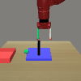

# Meta-world Environment Wrapper

To instantiate a single task, do this:


```python
task_name = "box-close-v1"
env = MWEnv(task_name)
frames = []
for i in range(200):
    obs = env.reset()
    # metaworld reset does not update the markers
    env.step(env.action_space.sample())
    frames.append(env.render('rgb', width=100, height=100))

doc.video(frames, f"videos/{task_name}.gif")
```



Note that the green marker is not going to set to hover
above the box unless you call reset.

Below is the fixed task:


```python
task_name = "box-close-v1"
env = MWFixedEnv(task_name)
frames = []
for i in range(200):
    obs = env.reset()
    # metaworld reset does not update the markers
    env.step(env.action_space.sample())
    frames.append(env.render('rgb', width=100, height=100))

doc.video(frames, f"videos/{task_name}.gif")
```


